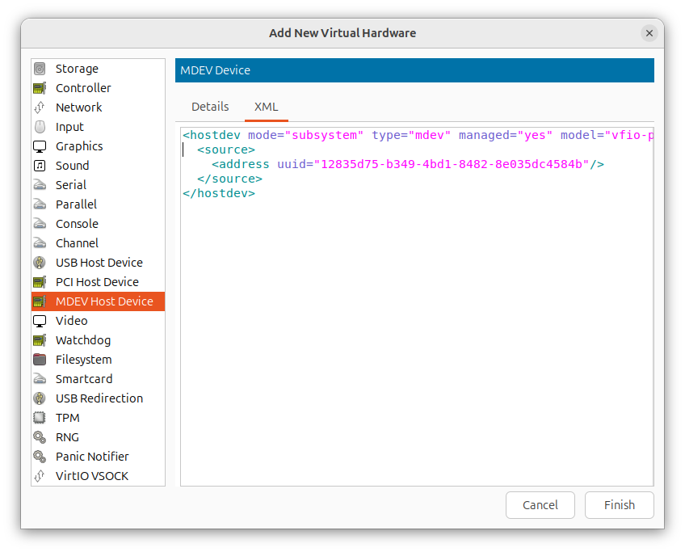

Looking Glass: tutorial for accelerated graphics in a KVM virtual machine using GVT-g (intel Core CPUs gen. 5-9)
=======================================================

This guide explains how to install Looking Glass (LG), which provides an accelerated graphics for a virtual machine running Windows 10 via iGPU passthrough, while maintaining graphical output on the Linux host. 

The [looking glass](https://looking-glass.io/) website brings this technology to the point: 

*Looking Glass is an open source application that allows the use of a KVM (Kernel-based Virtual Machine) configured for VGA PCI Pass-through without an attached physical monitor, keyboard or mouse. This is the final step required to move away from dual booting with other operating systems for legacy programs that require high performance graphics.*

The iGPU passthrough uses Intel GVT-g, which is a technology that provides a mediated device passthrough for Intel GPUs (Core CPUs gen. 5-9). See <https://wiki.archlinux.org/title/Intel_GVT-g>. 
Practically speaking in the VM, Windows 10 'sees' the GPU and uses the unmodified Intel graphics driver. Looking-glass transfers the VM's graphical frames with extremely low latency to the Linux host.

IMHO: From an end user's perspective, GVT-g remains attractive because the hardware is cheap, fast enough for many tasks, and there is full software support for GVT-g out of the box. It is noted that Intel discontinued GVT-g in favor for SR-IOV. But the official SR-IOV support state is in a bit of an awkward state. Intel announced that the upcoming Panther Lake SoCs with Xe3 integrated graphics is ready to go with official SR-IOV support: <https://www.phoronix.com/news/Intel-SR-IOV-PTL-ARL-State>

This guide is based on the excellent work of Pavolelsigs. See <https://github.com/pavolelsig/Ubuntu_GVT-g_helper>. 
His work is now five years old, hence this guide.

## General

Tested on Ubuntu 25.04. The VM is using KVM, qemu, libvirt with virt-manager as graphical frontend. The guest is Windows 10.

## Prerequisite

You already have a running virtual machine of Windows 10 with virt-manager as frontend for QEMU. How to prepare a Windows 10 VM in KVM/Virt-manager is not covered here, but there are many excellent guides  e.g. <https://gitlab.com/Luxuride/VFIO-Windows-install-walkthrough/-/blob/master/VmInstall.md>. As shown in this guide is is recommended to use the virtIO Windows drivers (<https://pve.proxmox.com/wiki/Windows_VirtIO_Drivers#Using_the_ISO>). It enables direct access to devices and peripherals for virtual machines, instead of slower, emulated, ones.

Note: any 64-bit version of Windows 10 should work, but Windows 10 LTSC is recommended. Windows 10 LTSC is an interesting release as it does not require secure boot, offers more predictable updates, and has an extended support period. More information can be easily found on github.

## Configuration of the VM

Disable secure boot in the VM. After stating the VM, press quickly F2 to enter the UEFI and under 'Device manager  / secure boot configuration' disable 'Attempt Secure Boot'.

* Install the spice-guest-tools <https://www.spice-space.org/download/windows/spice-guest-tools/spice-guest-tools-latest.exe>. The Windows SPICE Guest Tools contain some optional drivers and services  to improve SPICE performance and integration. This includes the qxl video driver and the SPICE guest agent (for copy and paste, automatic graphics resolution switching, ...).

The default of VM configuration must be adjusted (see <https://looking-glass.io/docs/B7/install_libvirt/>). 

This most easily done graphically in virt-manager. Open the details of the VM:

* Remove the Tablet device.

* Change Video QXL to VGA.

* Press add Hardware button and add VirtIO Keyboard.

* Add VirtIO mouse. This cannot be done graphically and we need to edit the VM configuration manually. Type `virsh edit your_VM_name` and change the line `<input type='mouse' bus='ps2'/>` to virtio: `<input type='mouse' bus='virtio'>`

* and find the line `<memballoon>` set its type to none: `<memballoon model="none"/>`.

* Before proceeding with the installation of LG, it is a good idea to do a snapshot of the VM. Most easily done graphically in the virt-manager frontend. This allows an easy 'rollback'.

## Installation of Looking Glass on the Linux host

* Check if KVM is supported: `kvm-ok`

* On the Linux host BIOS settings VT-x, IOMMU have to be enabled. Most likely not all settings are available but if VT-x is enabled, this should be ok. 

Check if your intel CPU if is gen 5-9: `cat /proc/cpuinfo`

* Add kernel boot parameters:
    * Edit `/etc/default/grub` and add the the parameters 				`intel_iommu=on i915.enable_gvt=1 kvm.ignore_msrs=1` to the line `GRUB_CMDLINE_LINUX_DEFAULT`. 
    Typically this looks like: `GRUB_CMDLINE_LINUX_DEFAULT="quiet splash intel_iommu=on i915.enable_gvt=1 kvm.ignore_msrs=1"`
    * After modifying the grub config, it is important run `update-grub` with no errors. 
    
* Loading of the kernel module `kvgt`. To load `kvgt` it during the boot, create the file `/etc/modules-load.d/kvmgt.conf` an populate it with:
	```
		# KVMGT kernel module
		kvmgt
    ```
Note: `kvmgt` depends on `i915, vfio, kvm, mdev` and hence these modules will be loaded automatically too.
* Update initramfs: `update-initramfs -u`
* Reboot.
* Check if the Kernel is started with the additional parameters: `cat /proc/cmdline` and whether the `kvmgt` kernel module is loaded: `lsmod | grep kvmgt`.

## Create the mediated virtual GPU

* Check whether the mediated virtual GPU devices (mdev) are available. Do a `find /sys/devices/pci* -name 'mdev_supported_types'`. A typical output is: `/sys/devices/pci0000:00/0000:00:02.0/mdev_supported_types`. `cd` into this directory and you'll see several directories: `i915-GVTg_V5_4  i915-GVTg_V5_8`. Each directory contains a `description`. For example `less /sys/devices/pci0000:00/0000:00:02.0/mdev_supported_types/i915-GVTg_V5_4/description` shows:
```
low_gm_size: 128MB
high_gm_size: 512MB
fence: 4
resolution: 1920x1200
weight: 4
```
Note: vGPUs with a higher weight value will get more physical GPU time slices.

To activate the mdev device we write an unique identifier number (uuid) to the `create` file.

To simplify these steps the script `init_VGPU.sh` is provided. This script finds the vGPU with the highest weight factor and initializes the mdev device at every startup by a service.
* Run the script `init_VGPU.sh` as root and reboot. 
* Check the output of `check_gpu.sh`. The output is the above mentioned uuid identifier from the activated mdev device.

# Installation of Looking glass client on the Linux host

The installation of LG is well documented. For completeness a brief overview.

* Download the LG client source for the Linux host: <https://looking-glass.io/>. In the time of writing B7. Go ahead with the compiling as described in  <https://looking-glass.io/docs/B7/build/>.

It is recommended to install the kernel module `kvmfr` for fast transfer of the frames from the VM to the host. See <https://looking-glass.io/docs/B7/module/#kernel-module>. Here a brief recap: 

* Installation of the kernel-headers: `apt-get install linux-headers-$(uname -r)` 

* Go into the module subdir and run `dkms install "."`. 
* Test to load the module: `modprobe kvmfr static_size_mb=32`
* Create the file `/etc/modprobe.d/kvmfr.conf` with:		
```
options kvmfr static_size_mb=32
```
and load the module during boot by creating a file `/etc/modules-load.d/kvmfr.conf` with:
	
```
 	# KVMFR Looking Glass module
kvmfr
```	

The kernel module uses `/dev/kvmfr0` which needs to have permission for user access. This can be achieved permanently by creating a udev rule in `/etc/udev/rules.d/99-kvmfr.rules` with:

```
SUBSYSTEM=="kvmfr", OWNER="user", GROUP="kvm", MODE="0660"
```

 and change user to your user to your `logname`. 

* Create `/etc/apparmor.d/local/abstractions/libvirt-qemu` and add the following:

```
# Looking Glass
/dev/kvmfr0 rw,
```

* Reboot and check if the kvmfr module is loaded: `lsmod | grep kvmfr` and check the permissions of the `ls -la /dev/kvmfr0` 

* Configuration of VM for the use of the kvmfr module. In one session of `virsh edit your_VM_name` change the first line from `<domain type='kvm'>` to 

```XML
<domain type='kvm' xmlns:qemu='http://libvirt.org/schemas/domain/qemu/1.0'>
``` 

and add 

```XML
<qemu:commandline>
  <qemu:arg value="-device"/>
  <qemu:arg value="ivshmem-plain,id=shmem0,memdev=looking-glass"/>
  <qemu:arg value="-object"/>
  <qemu:arg value="memory-backend-file,id=looking-glass,mem-path=/dev/kvmfr0,size=32M,share=yes"/>
</qemu:commandline>
```

at the end before `</domain>`.
## Final steps
In the VM configuration we add the passthrough vGPU: 
* Add Hardware 'MDEV Host Device'.


* Start the VM and open the device manager. Update drivers by a right mouse click. 


* Windows will automatically install the Intel GPU driver and finally the VM sees the vGPU. Note: I had to trigger this several times.


* Download the LG windows host binary. Run the installer as admin and restart the VM. See <https://looking-glass.io/docs/B7/install_host/#for-windows>

* Start the win10 VM. Log in.

* On the Linux host, enter the directory of the looking-glass client and start it: `looking-glass-B7/client/build/looking-glass-client -f /dev/kvmfr0 -F`. You might want to explore the many options of LG: `looking-glass-client -h`

* By defaul LG displays the secondary screen. For convenience, it is better to assign it to the primary screen and configure Windows to automatically log in without a password. Such an automatic login is recommended, as if there are any problems, you will always have a running desktop to which you can connect using Spice, e.g. via the command 'virt-viewer'.

* It is handy to have a startup script like:
```
#!/bin/bash
virsh start your_VM_name
sleep 2s
<your path>/looking-glass-B7/client/build/looking-glass-client -f /dev/kvmfr0 -F -c
```
  

* Enjoy!  

The graphics performance is excellent - close to bare metal.
Many thanks to Geoffrey McRae and all the other contributors for their great work.
 


  


 


  
 


 


 


 

 
